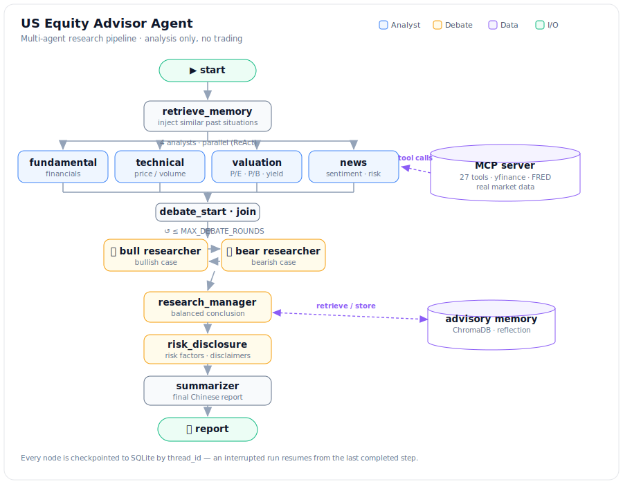

# US Equity Advisor Agent

A multi-agent system that produces in-depth research reports on US-listed equities. Four
specialist analysts (fundamentals, technicals, valuation, news) gather market data through an
MCP server and reason over it with an LLM; a summarizer consolidates their findings into a
single structured report.

This is an **analysis advisor** — it generates research only and never places trades.

## Features

- **27 MCP data tools** — quotes, financial statements, valuation, indices, macro, and news,
  behind a Model Context Protocol server. Market data is live and cached per run — equities,
  fundamentals and news via **yfinance**, macro series (rates, M2) via **FRED** — with no
  fabricated or static fallback data, so the agents reason over real numbers.
- **Parallel ReAct analysts** — fundamentals, technicals, valuation, and news run concurrently.
- **Bull/bear research debate** — opposing researchers debate the findings, bounded by
  `MAX_DEBATE_ROUNDS`, and a research manager synthesizes a balanced conclusion.
- **Risk disclosure** — a dedicated node compiles risk factors and disclaimers.
- **Cross-run memory + reflection** — past situations are stored in ChromaDB and recalled to
  calibrate later reports; realized outcomes can be backfilled with `--reflect`.
- **Resumable runs** — every run is checkpointed to SQLite and can be resumed by `thread_id`.
- **Optional local models** — Qwen-LoRA news scoring is off by default; the LLM API handles
  sentiment/risk so it runs with no GPU.
- **Web dashboard** — a Streamlit app (`app.py`) with live per-agent progress, the rendered
  report, a side-by-side bull/bear debate view, and memory browsing with reflection.

## Architecture



Every node is checkpointed to SQLite by `thread_id`, so an interrupted run resumes from the last
completed step. The four analysts run in parallel; the bull/bear loop is bounded by
`MAX_DEBATE_ROUNDS`. The report stays in Simplified Chinese while the codebase is English.

## Quickstart

```bash
# 1. Configure the LLM API
cd agent
cp .env.example .env          # set OPENAI_COMPATIBLE_API_KEY / _BASE_URL / _MODEL

# 2. Install dependencies (two self-contained uv projects)
cd ../mcp_server && uv sync
cd ../agent && uv sync

# 3. Run an analysis (prints a thread_id you can resume/reflect on)
uv run python src/main.py --command "分析 Apple (AAPL)"

# Resume an interrupted run, or backfill a realized outcome into memory
uv run python src/main.py --resume <thread_id>
uv run python src/main.py --reflect <thread_id> --outcome "AAPL +6% over 5 trading days"

# Or launch the web dashboard (live agent progress, report, debate view, memory)
uv run streamlit run app.py
```

Only an OpenAI-compatible API key is required to run locally. The optional Qwen-LoRA news
scoring models are disabled by default (no GPU needed).
